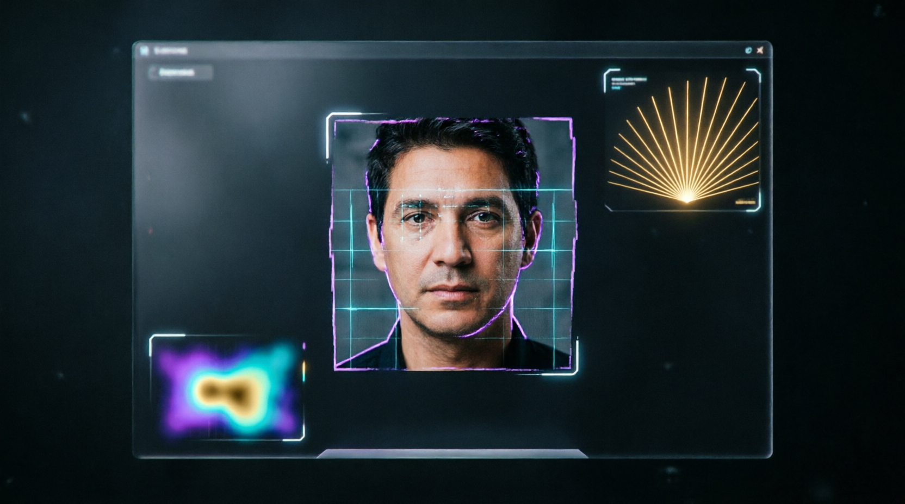
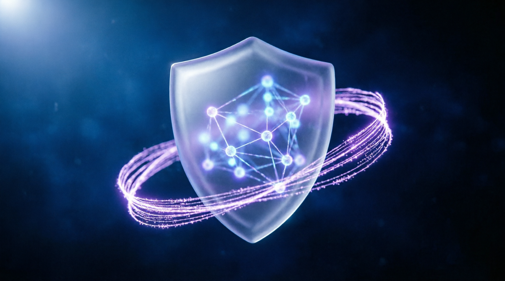

# 🛡️ Anti-AI Qwen Academy: Deepfake Detection Specialist

> Интерактивный 10-дневный курс для подготовки специалистов по детекции дипфейков в мультимодальных пайплайнах Qwen (Tongyi Qianwen). Работает полностью оффлайн!

## 🎯 О проекте

Курс обучает навыкам, необходимым для работы с моделями Qwen-VL и Qwen-Audio:

- 🧬 Архитектура Qwen и роль верификатора
- 🗃️ Типы синтетики в датасетах (GAN, Diffusion, adversarial)
- 🛡️ Оффлайн-инструменты проверки (EXIF, спектрограммы)
- 👁️ Детекция артефактов в изображениях
- 🔊 Аудио-верификация (voice cloning, jitter, спектр)
- 📝 RLHF разметка в форматах JSON/CSV
- 🧨 Red-Teaming и отчёты об уязвимостях
- 🔄 Модерация входящих запросов
- 📁 Портфолио из 5 кейсов в Qwen-форматах
- 🏆 Финальный экзамен и сертификат

## ✨ Особенности

| Функция | Описание |
|---------|----------|
| 🔐 **100% Offline** | Все данные хранятся локально в localStorage |
| 🌐 **Двуязычность** | Полная поддержка русского и английского |
| 🔊 **Voice-over** | Озвучивание текста через Speech Synthesis API |
| 📱 **Mobile Ready** | Адаптивный дизайн, работа на смартфонах |
| 🎓 **Сертификация** | Генерация сертификата с SHA-256 подписью |
| 🔍 **Валидация** | Проверка подлинности сертификатов |
| 💾 **Экспорт** | JSON сертификат + Qwen Portfolio |
| 🛡️ **Безопасность** | Усиленная CSP, защита от XSS |

## 📸 Скриншоты

| Главный экран | Уроки | Сертификат |
|---------------|-------|-------------|
|  |  |  

🤝 ПОДДЕРЖАТЬ ПРОЕКТ
💙
Приложение бесплатное. Было и останется.

Если проект помог вам или вашим близким — можете поддержать разработку добровольным переводом.

📱 ПЕРЕВОД ПО НОМЕРУ ТЕЛЕФОНА:
8-920-227-56-76
📋 Копировать номер
✅ Деньги придут мгновенно. Без комиссии. Безопасно.

❤️ Спасибо за поддержку!

🌟 👉https://ancf-hue.github.io/
Каталог бесплатных офлайн-приложений Anti-AI Shield.
